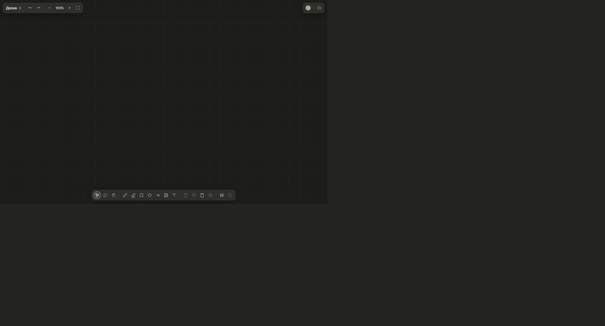
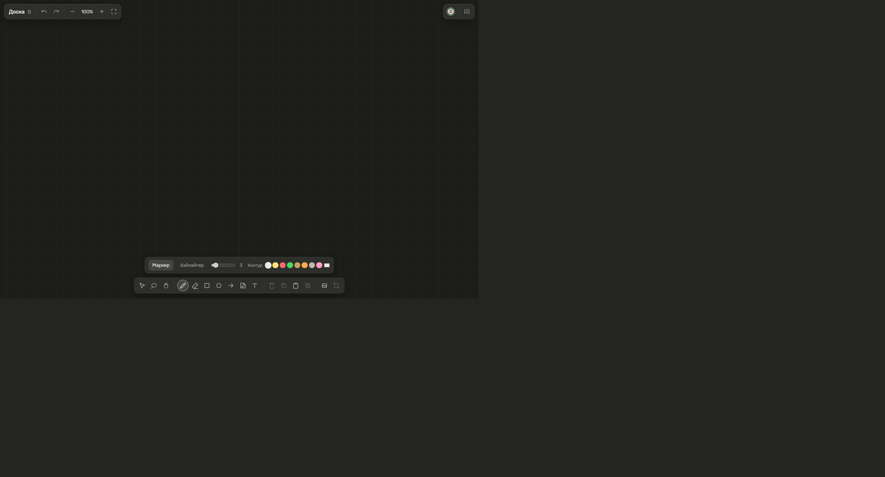
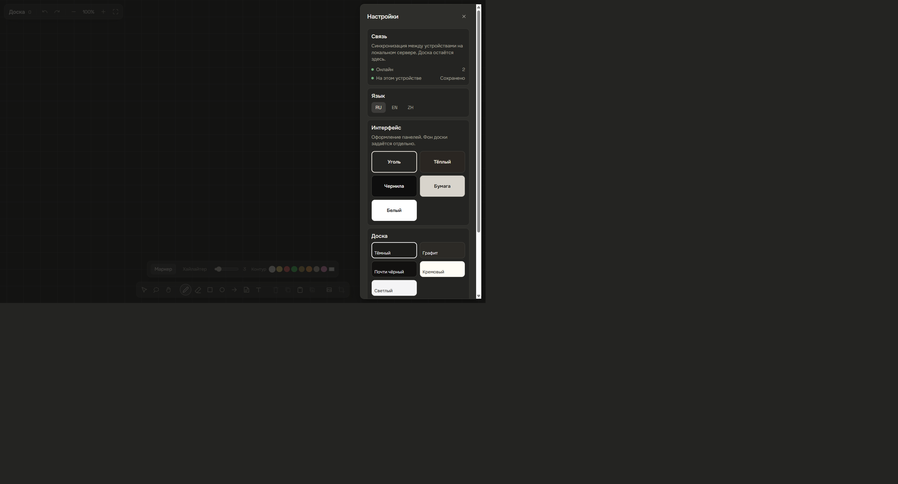

# Доска

[English](README.md) · [Русский](README.ru.md) · [中文](README.zh.md)

Локальная бесконечная доска. Маркер, стикеры, текст, картинки. Работает без сети. Совместное редактирование — это websocket на вашей машине или в локальной сети, не облачный аккаунт.

Репозиторий на GitHub называется ReView. На экране продукт — **Доска**.



## Что внутри

- Перо, хайлайтер, ластик (весь объект или кусок линии)
- Прямоугольник, эллипс, стрелка, стикер, текст
- Картинки: файл, вставка, drag-and-drop, обрезка
- Отмена / повтор, порядок слоёв, блокировка, ласо, рамка
- Сохранение в IndexedDB (`doska-v1`)
- Опциональная комната Yjs `doska` на `ws://<host>:1234`
- Интерфейс на русском (по умолчанию), английском, китайском
- Оформление панелей и бумага доски — разные настройки



## Запуск

Нужен Node 20+.

```bash
npm install
npm run dev
```

Vite поднимает приложение на [http://localhost:5173](http://localhost:5173), сервер синхронизации — `ws://localhost:1234`. Откройте страницу. Нарисуйте. Обновите: доска на месте.

Синхронизация необязательна. `npm run server` — только websocket. Два браузера на одной машине или другое устройство в LAN по IP хоста вместо `localhost` сидят в комнате `doska`.

`localhost` и `127.0.0.1` — разные origin. IndexedDB между ними не переезжает. Выберите одно.

```bash
npm test
npm run build
```



## Компоновка

Хром плавает над холстом на весь экран. Остров файла слева сверху (имя, отмена, зум). Присутствие и настройки справа сверху. Пояс инструментов снизу по центру. Остров стиля над поясом, когда живому инструменту или выделению это нужно. Связь и сохранение — в листе настроек.

## Лицензия

Apache License 2.0. См. [LICENSE](LICENSE).
